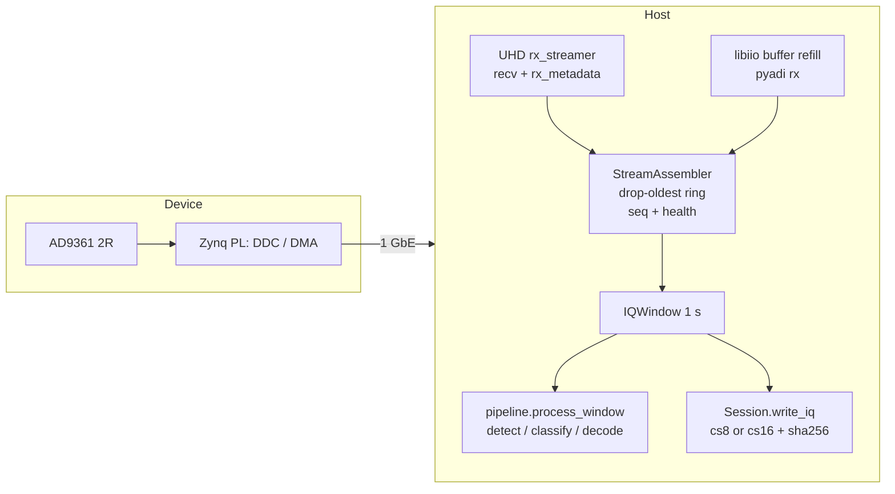
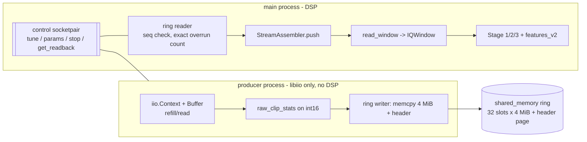

# ANTSDR E200 backend behind the AERIX RF receiver abstraction

Status: design proposal (Workstream A2). No code changed. Written before the
`antsdr-specialist` device survey landed; every claim that depends on the actual
firmware image is tagged **[SPEC]** (specialist-dependent) and every uncalibrated
throughput number **[INFERRED]**.

Scope: ANTSDR E200 (AD9361 + Zynq, Gigabit Ethernet) becomes the **primary** raw-IQ
receiver. HackRF stays as a secondary/reference backend and must keep working, byte
for byte, including replay of existing sessions.

---

## 1. Assessment of the current abstraction

What already exists and is genuinely hardware-neutral (`aerix_rf/sdr/capture.py`):

* `IQSource` — `capabilities` / `tune()` / `windows()` / `close()`, context manager.
  Good shape, no receiver branching downstream. Only two consumers read
  `capabilities` (`cli.py:64`, `main.py:37`), both only for `receiver_type`.
* `IQWindow` — `iq` (complex64), `captured_at`, `sample_rate`, `center_freq_hz`,
  `receiver_type`, `receiver_serial`, `gain_db`, `complete`, `dropped_samples`,
  `expected_samples`, `metadata`, plus `health()`. All five construction sites use
  keyword args, so appending fields with defaults is non-breaking.
* `ReceiverCapabilities` — already has tuning range, max rate, max instantaneous BW,
  `channels_rx`, `supports_hardware_timestamps`, `supports_external_clock`,
  `supports_external_pps`. The dataclass exists; it is simply not populated or used.
* `Session` / `session.json` — per-file `sample_rate`, `center_freq_hz`, `captured_at`,
  `complete`, `dropped_samples`, `expected_samples`, `receiver_type`, `receiver_serial`,
  `gain_db`, `capture_health`, `sha256`. `Session.open()` does **not** validate
  `schema_version`, so additive schema changes are automatically tolerated by old readers.
* Health vocabulary (`overflow_count`, `gap_before_samples`, `short_reads`,
  `stream_rate_ratio`, `capture_complete`) is USB-shaped in origin but semantically
  generic: "backend dropped buffers", "stream lost between windows", "achieved vs
  nominal rate". It maps cleanly onto UHD `ERROR_CODE_OVERFLOW` and libiio refill loss.

### Implicitly HackRF-specific — must generalize

| # | Coupling | Where | Consequence for ANTSDR |
|---|---|---|---|
| H1 | **IQ is cs8, ±128, hardcoded** | `to_cs8()`, `_read_cs8()`, `Session.write_iq()` | AD9361 delivers 12-bit. Writing cs8 throws away ~4 bits of headroom; there is no format field to say otherwise. |
| H2 | **No analog bandwidth anywhere** | `Config`, `IQWindow`, `session.json` | AD9361 has an independently settable `rx_rf_bandwidth` distinct from `sample_rate`. Currently unrepresentable, so a capture's real filter shape is unrecorded. |
| H3 | **Gain model is `lna`/`vga`/`amp`** | `Config`, `--lna/--vga/--amp`, `_receiver_meta()`, `session.json:gains` | AD9361 has one `rx_hardwaregain` plus an AGC *mode* (manual / slow_attack / fast_attack / hybrid). No place to record which mode was active — which silently invalidates RSSI comparisons between sessions. |
| H3b | `gain_db` is set to `lna+vga` | `LibHackRFSource` | Summing two gain stages into one number is a HackRF convention, not a calibrated dB figure. Keep it, but stop pretending it is comparable across receivers. |
| H4 | **`scan`/`baseline` shell out to `hackrf_sweep`** | `scan/sweep.py`, `tools/sweep_locate.py` | The single largest hidden coupling. There is no ANTSDR equivalent binary, and sweep is not part of `IQSource` at all. As written, `aerix-rf scan` and `aerix-rf baseline` simply cannot run on ANTSDR. |
| H5 | **`make_source()` is a HackRF-only fallback chain** | `capture.py` | Ends with `RuntimeError("no usable HackRF backend")`. `--backend` help string enumerates HackRF backends only. |
| H6 | **`cmd_info` opens a HackRF directly** | `cli.py:cmd_info` | `HackRFStream(20e6, 2440e6)` is hardcoded; `info` will always look broken on an ANTSDR box. |
| H7 | **20 MS/s default framed as "HackRF Pro max"** | `Config.sample_rate` | Not a universal rate; see §6. |
| H8 | **Timestamp is host wall clock only** | `captured_at: float` | No sample counter, no device time, no clock-source statement. Cannot support TDOA and, worse, nothing in the record *warns* that it cannot. |
| H9 | **Single channel is structural** | `windows()` yields one `IQWindow` | No `channel_id`; simultaneous 2R captures cannot be correlated. |

Everything else (pipeline, detector, classifier, DroneID decoder, session report) already
consumes `IQWindow` generically and needs no change. The decoder resamples whatever it
gets to `ofdm.NOMINAL_SAMPLE_RATE = 15.36 MHz` — which becomes relevant in §6.

---

## 2. `AntsdrSource` — two candidate host paths

Both paths share one design: a **producer thread** doing blocking device reads into a
bounded queue with **drop-oldest** policy, and a **consumer** (`read_window(n)`) that
assembles exactly `n` samples and accounts for losses. This is exactly the
`HackRFStream` model, deliberately — so `overflow_count` / `gap_before_samples` /
`complete` mean the same thing on every backend.

**Refactor first:** lift the sequence-numbered assembly + health accounting out of
`libhackrf.py` into a backend-neutral `sdr/stream.py:StreamAssembler`
(`push(chunk, seq, ts, center)` / `read_window(n) -> (iq, info)`), with a per-backend
`full_scale` and `raw_dtype`. `HackRFStream` then becomes a thin producer. This keeps
HackRF and ANTSDR health semantics identical by construction rather than by review.



### Path A — UHD (preferred if the device runs a UHD-compatible image) **[SPEC]**

* In-process `uhd.usrp.MultiUSRP("addr=<ip>")`; **do not** shell out to
  `rx_samples_to_file` — a subprocess reintroduces exactly the inter-window gap problem
  that `HackrfTransferSource` has and loses metadata.
* Stream: `cpu_format="fc32"` (host-side float, no manual scaling), `otw_format="sc16"`
  by default, `"sc8"` if the firmware accepts it (§6).
* `recv(buf, md)` per ~16–64 ki samples. `md.time_spec` gives a **device** timestamp;
  `md.error_code == ERROR_CODE_OVERFLOW` gives an authoritative overflow signal;
  `md.out_of_sequence` flags packet loss. Maintain `sample_index` monotonically from
  `time_spec` × rate, so a gap is *measured*, not inferred.
* Retune: `set_rx_freq(TuneRequest)`; flush the assembler after retune (same as HackRF).
* Timing: `set_time_now()` at start; `set_time_unknown_pps()` if a PPS is present.
  This path is the one that makes future TDOA credible.
* dtype: `fc32` already ±1.0 full scale → `full_scale = 1.0`, no conversion.

### Path B — libiio / `pyadi-iio` network context (fallback, and likely current state)

* `adi.ad9361(uri="ip:<addr>")`. Attributes: `rx_lo`, `sample_rate`,
  `rx_rf_bandwidth`, `gain_control_mode_chan0`, `rx_hardwaregain_chan0`,
  `rx_enabled_channels`, `rx_buffer_size`.
* Buffer sizing: `rx_buffer_size = 2**18` (262144 samples ≈ 17 ms at 15.36 MS/s),
  kernel buffer count 4–8. Rationale: one 1 s window is ~15.4 M samples, far too large
  for a single buffer; 17 ms chunks match libhackrf's 256 KiB transfer granularity so
  the assembler's gap arithmetic is tuned the same way.
* dtype: `rx()` returns int16 carrying **12-bit left-justified or right-justified**
  data **[SPEC]** — the effective full scale must be *measured*, not assumed
  (`full_scale = 2048` vs `32768` differ by 24 dB and would silently shift every RSSI).
  Determine empirically at bring-up with a known input level; encode as a backend
  constant and record it in `session.json` (`iq_full_scale`).
* Overflow/gap: libiio gives **no per-buffer sequence number**. Detect loss by
  (a) any firmware-exposed xflow attribute if present **[SPEC]**, and (b) wall-clock
  vs delivered-sample drift (`stream_rate_ratio`, already implemented). Windows are
  therefore marked `complete=True` but with `dropped_samples=None` and
  `metadata.loss_detection = "inferred_rate_only"`. **Do not fabricate a
  `dropped_samples` integer on this path** — honest `None` beats a fake zero.
* Timing: host wall clock only. `clock_source="host"`, `timing_confidence="host_clock"`,
  `sample_index` derived from a host-side running counter (valid within one stream,
  meaningless across nodes).
* Retune: write `rx_lo`, then flush the assembler.

**Decision rule:** if the device exposes a working UHD image, prefer Path A and keep
Path B as `--backend antsdr-iio`. If only IIO is available, ship Path B as the default
and record `supports_hardware_timestamps=False` so no downstream code ever assumes TDOA
readiness. Both are the same class family; the difference is one producer module.

---

## 3. Capability model

Reuse the existing `ReceiverCapabilities`, extended (all new fields defaulted):

```text
receiver_type, min_freq_hz, max_freq_hz                 (exists)
max_sample_rate, max_instantaneous_bw_hz, channels_rx   (exists)
supports_hardware_timestamps / _external_clock / _pps   (exists)
+ min_sample_rate: float
+ sample_rates: tuple[float, ...] | None   # None = continuous range
+ min_bandwidth_hz / max_bandwidth_hz      # settable analog filter, None if fixed
+ tunable_bandwidth: bool                  # HackRF: False. AD9361: True
+ gain_stages: tuple[GainStage, ...]       # name, min_db, max_db, step_db
+ gain_modes: tuple[str, ...]              # ("manual",) | ("manual","slow_attack",...)
+ iq_formats: tuple[str, ...]              # ("cs8",) | ("cs8","cs16")
+ supports_sweep: bool                     # hackrf_sweep-style hardware sweep
+ supports_retune_while_streaming: bool
+ antenna_ports: tuple[str, ...]
+ full_scale: float                        # raw -> +-1.0 normalisation divisor
```

Layering:

* **Common semantics** (never backend-branched downstream): complex64 IQ normalized to
  ±1.0 full scale; 1 s windows at a declared `sample_rate`; `captured_at`;
  `complete`/`dropped_samples`; `center_freq_hz`.
* **Backend capability discovery**: the table above. CLI and scan logic must consult it
  instead of assuming 20 MS/s or `hackrf_sweep`.
* **HackRF-specific**: lna/vga/amp gain triple, `hackrf_sweep`, cs8-native samples.
* **ANTSDR-specific**: `rx_rf_bandwidth`, AGC modes, 2R channels, device timestamps,
  PPS/10 MHz inputs.
* **Optional accelerated / event-producing path**: DJI-event firmware (alphafox02
  `antsdr_dji_droneid`) is a *different* interface — `RFEventSource` yielding normalized
  events, **not** `IQWindow`. It must never be a prerequisite for the baseline path, and
  on a single device it is likely mutually exclusive with raw-IQ streaming **[SPEC]**.
* **Later FPGA-movable**: DDC/decimation, a power-detector sweep engine, burst gating.
  None of these may change the host-side contract when they arrive.

Metadata that must survive the abstraction (for multi-receiver/TDOA later):
`sample_index` (monotonic, per stream), `device_time_ns`, `clock_source`
(`host|internal|external_10mhz|gpsdo`), `pps_locked`, `clock_uncertainty_ns`,
`center_freq_hz`, `bandwidth_hz`, gain stage values **and** gain mode,
`dropped_samples`, `channel_id`, `receiver_serial`.

---

## 4. `session.json` changes (additive, backward-compatible)

Bump `schema_version` to 2. `Session.open()` performs no version check today, so
schema-1 sessions keep loading; readers must treat every new key as optional with the
documented default.

Top level:

```json
"receiver_type": "antsdr_e200",
"receiver_backend": "AntsdrUhdSource",
"receiver_firmware": "<version string>",
"receiver_driver": "uhd 4.6.0" | "libiio 0.25 / pyadi 0.0.17",
"iq_format": "cs8",            // default when absent: "cs8"
"iq_full_scale": 128.0,        // default when absent: 128.0
"bandwidth_hz": 15360000.0,    // default when absent: null
"clock_source": "host",
"channels": [{"channel_id": 0, "antenna": "RX1", "center_freq_hz": 2.44e9}]
```

Per-file entry (`files[]`), all optional:

```json
"iq_format": "cs16", "iq_full_scale": 2048.0, "bandwidth_hz": 15360000.0,
"channel_id": 0, "capture_group": "<uuid>",     // links simultaneous channels
"sample_index": 123456789, "device_time_ns": null,
"clock_source": "host", "pps_locked": false, "clock_uncertainty_ns": null,
"gain": {"mode": "manual", "stages": {"rx_hardwaregain": 40.0}}
```

The `gains` block stays as-is for HackRF (lna/vga/amp/gain_db) so existing report code
and old sessions are untouched; the new `gain` block is the general form.

Replay: `FileIQSource` gains `iq_format` / `iq_full_scale` from `meta` and dispatches to
`_read_cs8` or a new `_read_cs16`. Absent → cs8/128.0 → existing HackRF sessions replay
bit-identically. This is a hard acceptance criterion (§7, T1).

---

## 5. Dual-RX (interface only, no implementation now)

* `IQWindow.channel_id: int = 0` — single-channel consumers are unaffected.
* `IQSource.windows()` keeps its signature and always yields channel 0.
* A new optional protocol on multi-channel sources:
  `window_sets() -> Iterator[tuple[IQWindow, ...]]`, yielding one tuple per capture
  instant, all members sharing `capture_group`, `captured_at` and `sample_index`.
* `ReceiverCapabilities.channels_rx` tells callers whether `window_sets()` exists.
* Session: one file per channel, linked by `capture_group`.
* Phase/coherence between AD9361 RX1/RX2 is **not** claimed by this interface. Coherent
  dual-RX requires verified LO sharing and a calibration procedure **[SPEC]**; until
  measured, record `channel_coherent: false`.

---

## 6. Ethernet-rate reality **[INFERRED — specialist must measure]**

Practical 1 GbE payload ceiling: ~940 Mbit/s ideal, and considerably less on a Zynq-7020
PS GEM with a non-zero-copy IIO network backend. Assume 400–700 Mbit/s sustained until
measured.

| Rate | 16-bit IQ (4 B/sa) | 8-bit IQ (2 B/sa) | Disk at cs8 |
|---|---|---|---|
| 61.44 MS/s | 245.8 MB/s = 1.97 Gbit/s — impossible | 122.9 MB/s = 983 Mbit/s — impossible | — |
| 30.72 MS/s | 122.9 MB/s = 983 Mbit/s — impossible | 61.4 MB/s = 491 Mbit/s — plausible | 221 GB/h |
| **20 MS/s** | 80 MB/s = **640 Mbit/s — marginal** | 40 MB/s = 320 Mbit/s — comfortable | 144 GB/h |
| **15.36 MS/s** | 61.4 MB/s = **491 Mbit/s — plausible** | 30.7 MB/s = 246 Mbit/s — comfortable | 111 GB/h |
| 7.68 MS/s | 30.7 MB/s = 246 Mbit/s — safe | 15.4 MB/s = 123 Mbit/s — safe | 55 GB/h |

Consequences:

1. **Recommended ANTSDR default: 15.36 MS/s, 16-bit wire.** It fits the link with margin,
   and it is *exactly* `ofdm.NOMINAL_SAMPLE_RATE`, so the DroneID decoder stops
   resampling (`resampled=False`) — less CPU and one fewer interpolation artefact in the
   most important decode path. Cost: a 15.36 MHz observed slice instead of 20 MHz.
2. Keep **20 MS/s selectable** for apples-to-apples cross-validation against the existing
   HackRF golden session. Expect it to be the first thing that overflows on a weak link.
3. 8-bit wire format (`otw_format="sc8"` on UHD; unlikely on plain IIO **[SPEC]**) is the
   escape valve if 16-bit at 20 MS/s proves unreliable. It costs ~4 bits of dynamic range
   — acceptable given we already store cs8 on disk, but it should be an explicit flag,
   not a silent default.
4. **FPGA-side decimation matters** exactly when we want a *wide* view: any rate above
   ~20 MS/s is only reachable by decimating or channelizing in the PL before the link.
   That is a later optimization, not a baseline requirement. Baseline = raw IQ to host.
5. Storage: cs8 stays the default session format for both receivers. cs16 is opt-in for
   research captures (`--iq-format cs16`), because it doubles a 144 GB/h firehose.

---

## 7. Implementation plan for `sdr-backend-builder`

Ordered, bounded, each independently testable. **T1–T3 need no ANTSDR hardware.**

**T1 — Generalize the IQ payload contract.** Add `IQWindow.bandwidth_hz`,
`channel_id`, `timing` (dict: `sample_index`, `device_time_ns`, `clock_source`,
`pps_locked`, `clock_uncertainty_ns`); add `_read_cs16`/`to_cs16`; add `iq_format` /
`iq_full_scale` to `Session.write_iq()` and `FileIQSource`; bump `schema_version` to 2.
*Accept:* full existing test suite green; a checked-in schema-1 HackRF session replays to
byte-identical detections/decodes; a cs16 round-trip test is lossless; `to_cs8`/`_read_cs8`
behaviour unchanged.

**T2 — Extract `sdr/stream.py:StreamAssembler`.** Move sequence-numbered assembly,
drop-oldest policy and health accounting out of `HackRFStream`. *Accept:* HackRF path
produces identical `info` dicts on a synthetic chunk sequence; unit tests inject
chunk sequences with holes and assert `dropped_samples` / `gap_before_samples` /
`complete` exactly.

**T3 — Capability model + backend registry.** Extend `ReceiverCapabilities`; populate
`HACKRF_CAPS`; replace `make_source()`'s hardcoded chain with a registry keyed by
receiver (`AERIX_RF_RECEIVER=hackrf|antsdr|sim|file`, `--backend` selecting the transport
within it); make `cmd_info` backend-generic. *Accept:* `--backend` list is discovered,
not hardcoded; error messages name the requested receiver; `--sim`/`--iq-file` unaffected.

**T4 — `AntsdrSource` producer, both paths.** `sdr/antsdr_iio.py` and `sdr/antsdr_uhd.py`,
both feeding `StreamAssembler`; lazy imports so neither `pyadi-iio` nor `uhd` is a hard
dependency; generic gain config (`--gain-mode`, `--gain rx_hardwaregain=40`) with
`--lna/--vga/--amp` kept as HackRF aliases; `--bandwidth-hz`. *Accept (no hardware):* a
fake producer harness drives each source class through a mocked device object — retune,
overflow, short read, stream stop — and asserts window metadata; a recorded-IQ producer
replays a file through the same assembler and yields windows indistinguishable from
`FileIQSource` output apart from `receiver_type`.

**T5 — Backend-neutral sweep.** Add `SweepSource` capability. Keep `hackrf_sweep` as the
HackRF implementation; add a generic retune+Welch sweeper built on `IQSource` for any
receiver where `supports_sweep=False`. *Accept:* `scan`/`baseline` produce the same
`(freqs_mhz, power_matrix)` shape from either implementation; existing `test_scan.py`
green; generic sweeper validated against a synthetic multi-tone source.

**T6 — Hardware acceptance (needs the device).**
ANTSDR → `aerix-rf capture` → session → `aerix-rf replay` → DroneID decoder → CRC-valid
decode, with the 2026-09-04 HackRF Mini 3 session as golden reference.
*Accept:* (a) 10-minute soak at 15.36 MS/s with `stream_rate_ratio ≥ 0.99` and zero
incomplete windows; (b) `session.json` records format/bandwidth/gain-mode/clock-source;
(c) replay is deterministic and sha256-verified; (d) at least one CRC-valid DroneID decode
from an ANTSDR capture of the same aircraft; (e) HackRF regression run on the same host
shows no behaviour change.

---

## 8. Risks and open questions

**[SPEC] — blocked on the `antsdr-specialist` device survey**

1. Which firmware image is on the device: UHD-compatible, PlutoSDR/IIO-style, or the DJI
   DroneID event firmware? This picks the default backend and decides whether hardware
   timestamps exist at all.
2. Is the IIO int16 data 12-bit left- or right-justified — i.e. is `full_scale` 2048 or
   32768? Getting this wrong shifts every RSSI by 24 dB without any error.
3. Does the image expose any overflow/xflow counter? If not, `dropped_samples` stays
   `None` on the IIO path and capture health is weaker than on HackRF.
4. Are RX1 and RX2 both broken out, and is 2R streaming enabled in the PL bitstream?
5. Can the device stream raw IQ and run DJI-event firmware at the same time, or is it a
   reflash-level choice?
6. PPS / 10 MHz reference connectors — present, and wired to the AD9361/PL?
7. `otw_format="sc8"` accepted on the UHD path?

**[INFERRED] — needs measurement, not research**

8. Actual sustained GbE throughput (§6). Everything about the default sample rate hinges
   on this. Measure before freezing the default.
9. Whether a host that currently keeps a 20 MS/s HackRF window under 1 s can keep up with
   a 16-bit ANTSDR stream (2× the host-side byte rate before conversion).

**Design risks**

10. Silent dynamic-range regression: AD9361 12-bit stored to cs8 loses headroom. The
    `iq_format` field makes it visible, but the default must be chosen deliberately.
11. Cross-receiver RSSI comparability: HackRF `lna+vga` and AD9361 `rx_hardwaregain`
    are not the same quantity. Until a calibration step exists, `gain_db` must not be
    used to compare absolute levels across receiver types.
12. AGC on the ANTSDR would make burst amplitudes non-stationary within a window and
    could corrupt cadence/duty-cycle morphology. Default to **manual gain**; treat
    `slow_attack` as an experiment, and always record the mode.
13. Sweeping by retune is much slower than `hackrf_sweep`; scan dwell/latency expectations
    in the field-test protocol may need revising for ANTSDR.
14. Evidence-level discipline: an ANTSDR DJI-event firmware output is a *vendor-decoded
    claim*, not our CRC-valid decode. It must enter as its own evidence level with an
    explicit source, never be merged into stage-3 decode records.

## Measured host-path throughput (2026-09-18)

All runs: E200 stock IIO image, `antsdr_iio` default profile (12.288 MS/s, rf_bandwidth 10 MHz,
cs16 / full scale 2048, manual gain 40 dB), `aerix-rf capture --center-mhz 2437` through the full
Stage-1/2/3 pipeline on the 24-core dev host. Ground truth = one-second windows produced vs wall clock.

| Run | Duration | IQ to disk | Device buffers | Windows / wall | Effective rate | Notes |
|---|---|---|---|---|---|---|
| soak10min_b | 600 s | on (49 MB/s cs16, hit 6 GB cap at 122 s) | 8 × 1 M | 560 / 590.9 s | ≈11.64 MS/s (**−5 %**) | concurrent `pytest` full-suite runs by other agents on the same host |
| probe_default | 60 s | on | 8 × 1 M | 60 / ~57 s streaming | ≈12.29 MS/s (0 %) | idle host |
| probe_k32_4m | 60 s | on | 32 × 4 M | 59 / ~57 s streaming | ≈12.29 MS/s (0 %) | idle host |
| a_iq_default | 300 s | on | 8 × 1 M | 300 / 301.5 s incl. setup | ≈12.29 MS/s (0 %) | idle host |
| b_noiq_default | 300 s | off (`--no-iq`) | 8 × 1 M | 300 / 301.4 s incl. setup | ≈12.29 MS/s (0 %) | idle host |
| soak600_default_noiq | 600 s | off | 8 × 1 M | **600 / 601.5 s incl. setup** | ≈12.29 MS/s (0 %) | idle host — A4 soak criterion met (ground truth) |
| soak600_k32_4m_iq | 600 s | on (cs16, 40 GB cap) | 32 × 4 M | **599 / 601.5 s incl. setup** | ≈12.29 MS/s (0 %) | idle host — larger device buffers also clean; run (c) superseded |
| c_iq_k32_4m | 300 s planned | on | 32 × 4 M | aborted at 65 s | — | host tmpfs ran out of space (session root was on /tmp); rerun owed |
| bare libiio loop (no DSP) | 25 s | — | 8 × 1 M | — | 12.297 MS/s (ratio 1.0007) | `rx_throughput_test2.py` |

Conclusions (MEASURED): at the default profile the AERIX host path sustains the full rate with or
without IQ writing on an otherwise idle host; the only observed loss (−5 % over 10 min) occurred
while other CPU-heavy processes ran on the same host, consistent with producer-thread starvation
(the libiio path has no overflow counter, so such loss is silent). Consequences: (1) the field box
must not share CPU with unrelated heavy work — document as a deployment rule; (2) `stream_rate_ratio`
is now cumulative since the first chunk plus a trailing-5 s `stream_rate_ratio_recent`, with
`rate_warning` at cumulative < 0.995 (after 10 s) or recent < 0.98, and a `samples_deficit` count —
the per-window ratio previously jittered ±2 % and fired false warnings on loss-free runs;
(3) `AERIX_RF_ANTSDR_KBUFS` / `AERIX_RF_ANTSDR_BUFSAMPLES` exist for larger device-side buffering;
whether 32 × 4 M protects against contention is UNMEASURED (run (c) owed on an idle host, plus a
repeat 10-minute soak with nothing else running). Never place a session root on tmpfs.

---

## T7 — acquisition producer as a separate OS process (2026-09-18)

**Decision.** §14/§14.1 of `research/briefs/antsdr-e200.md` isolated the mechanism: 12 busy *OS
processes* do not perturb the libiio producer (ratio 0.9998), while an expensive consumer inside the
producer's *own* process collapses it (ratio 0.41). The fix is therefore structural, not a deployment
rule: run the libiio producer as its own OS process, handing samples to the DSP process through shared
memory. `StreamAssembler`/`IQWindow` semantics are unchanged; only the producer moves.

### 1. Process model



* Producer entrypoint is a module (`python -m aerix_rf.sdr.producer_main`), started with
  `multiprocessing` **spawn** (fork would inherit the parent's numpy/DSP state and fds). It does
  *only* refill/read, `raw_clip_stats`, header write, memcpy — no complex64 conversion, no per-chunk
  pickling — inside ~85 ms of wall time per 1 M-sample chunk at 12.288 MS/s.
* Control channel: `multiprocessing.Connection` socketpair, JSON-only request/response. Ops:
  `tune(center_hz)`, `set_params(gain/bw/rate)`, `get_readback(epoch)`, `stop`, `ping`. Readback
  dicts are **never** sent per chunk: the header carries a `meta_epoch` u32 and the consumer pulls a
  new snapshot only when it changes. Retune is applied between refills; the first chunk after it
  carries `flags.RETUNE`, on which the consumer calls `StreamAssembler.flush()`.

### 2. Ring and header (backend-neutral)

Global header (first 4 KiB page): magic/version, `slot_count`, `slot_bytes`, `chunk_samples`,
`sample_rate`, `iq_format`, `raw_full_scale`, `write_seq` (latest published), `read_seq` (diagnostic
only — the producer **never** blocks on it), `producer_pid`, `producer_state`, `heartbeat_mono_ns`,
`producer_errno`, device counters. Per-slot header (64 B, cacheline-aligned, kept in a header array
so payloads stay page-aligned):

| field | type | meaning |
|---|---|---|
| `seq` | u64 | chunk sequence, monotone from 0; also the seqlock (published last, re-checked after read) |
| `sample_index` | u64 | index of this chunk's first sample since stream start |
| `n_samples` | u32 | samples in this chunk (complex pairs) |
| `flags` | u32 | RETUNE / PRODUCER_RESTART / DEVICE_WARNING |
| `t_mono_ns` | u64 | CLOCK_MONOTONIC at refill completion (timing/rate math) |
| `t_wall_ns` | u64 | CLOCK_REALTIME (session metadata only) |
| `center_freq_hz` | f64 | LO in force for this chunk |
| `clip_count` / `peak_abs` | u32 / f32 | from `raw_clip_stats` in the producer |
| `meta_epoch` | u32 | readback-snapshot generation |

Reader protocol: read slot header → `np.frombuffer` view → consume → re-read `seq`; if `seq`
changed the producer lapped us, so the data is discarded and counted (below). **v1 copies the 4 MiB
into a private buffer** (~0.4 ms, <0.5 % of the 85 ms budget) because the assembler's queue can hold
more stream than the ring spans; zero-copy is a later flag, valid only when `ring_span_s >
queue_max_s + margin`. Backend-neutral: the ring, both headers, the control op set, the exact-overrun
accounting. libiio-specific: refill semantics, `kernel_buffers`, ad9361 attr names, readback
contents, and `loss_detection="inferred_rate_only"`. HackRF can adopt the same ring unchanged (cs8
chunks, `raw_full_scale=128`, device-side `loss_detection="exact"` from its sequence numbers).

### 3. Failure semantics

| Failure | Detection | Reported as |
|---|---|---|
| Producer death | control-pipe EOF + `heartbeat_mono_ns` stale > 1 s | stream ends; in-flight window emitted `complete=False`; `stream_end_reason="producer_exit"`, exit code + stderr tail in `session.json` |
| Consumer stall / ring overrun | `write_seq - last_consumed > slot_count`, or post-read `seq` mismatch | `host_dropped_samples += skipped_chunks * chunk_samples` (**exact**), `host_overrun_events += 1`, window `complete=False`, `gap_before_samples` exact. Never silent. |
| Device eviction (other libiio client, link drop) | `refill()` raises | producer sets `producer_state=ERROR` + errno, final heartbeat, exit non-zero. **No auto-reconnect in v1** — a silent reconnect manufactures an unmeasured gap. |
| Clean shutdown | `stop` op | producer destroys the Buffer, resets debug attrs it set (`bist_tone` → `0 0 0 0`), closes the context, exits 0; consumer joins (5 s) → SIGTERM → SIGKILL, then `shm.close()/unlink()` in a `finally`. |

Loss vocabulary splits in two and stays honest: `loss_detection` keeps its meaning — the
**device→host** link, still `"inferred_rate_only"` on libiio — while a new
`host_loss_detection="exact_ring"` with an always-integer `host_dropped_samples` covers the **host
transport**. Never merge them: one is inferred, one is counted.

### 4. Latency and memory at 12.288–13.44 MS/s cs16

Chunk 1 Mi samples = 4 MiB = 85.3 ms @12.288, 78.0 ms @13.44; stream 49.2 / 53.8 MB/s. Ring
**32 slots = 128 MiB payload** → 2.73 s @12.288, 2.50 s @13.44 (≥2 s met). Added latency: one chunk
publication (~85 ms) + ~0.4 ms memcpy, negligible against the 1 s window. Producer RSS ≈ 60–90 MB
(numpy + libiio, no DSP). Device-side kernel buffers (8 × 1 M ≈ 0.68 s) are unchanged and stack in
front of the ring.

### 5. Testability without hardware

`producer_main --source synthetic` generates paced cs16 chunks (tone + noise) through the identical
ring/control path, with injection flags `--stall-after N`, `--die-after N`, `--drop-chunk k`,
`--slow-refill`. Tests use a small ring (4 × 64 ki) to stay fast and assert: exact
`host_dropped_samples` under a slow consumer, stream end on producer death within 1 s, clean
`/dev/shm` after every case.

### 6. Acceptance

(a) 600 s at 12.288 MS/s, full Stage-1/2/3 with `features_v2` live enabled (a deliberately heavy
consumer), BIST tone injected by the producer: **zero device-side phase-jump events**, every
host-side gap exactly accounted (sum of `host_dropped_samples` == measured missing samples).
(b) Same run under concurrent pytest-suite load: same criterion. (c) `windows/wall ≥ 599/601.5`,
no `/dev/shm` residue, `bist_tone` verified `0 0 0 0` afterwards.

### 7. Builder task split

| Task | Scope | Acceptance |
|---|---|---|
| **T7a** `sdr/shmring.py` | Neutral ring: header structs, writer/reader, seqlock, exact overrun accounting, wrap. No processes. | pytest: header round-trip, wrap, lap detection, overrun count exactness, clean unlink |
| **T7b** `sdr/producer_main.py` + `sdr/process_source.py` | spawn supervision, control socketpair, `meta_epoch` readback fetch, synthetic source + injection flags, ring→`StreamAssembler`→`IQWindow` glue with the new host-loss fields | pytest with real subprocesses: kill / stall / clean stop / retune flush; exact loss; no shm leak |
| **T7c** wiring | `--backend antsdr-proc` uses the producer process for the real libiio device; `session.json` gains `host_dropped_samples`, `host_overrun_events`, `host_loss_detection`, `producer_pid`, `stream_end_reason`; docs | hardware: acceptance (a)–(c) above |

### 8. Risks

1. **Python startup on the field box** — spawn + numpy + iio import is ~0.5–1.5 s; keep it inside
   `open()`. `stream_rate_ratio`'s clock already starts at the first pushed chunk, so it must not be
   charged as lost stream.
2. **Shared-memory cleanup** — a crash leaks 128 MiB in `/dev/shm`; name segments `aerix-rx-<pid>-<uuid>` and sweep stale ones at startup. `resource_tracker` in spawn children emits spurious leak warnings.
3. **Pickling** — solved by design (`meta_epoch`, JSON-only control payloads), but the readback dict must be JSON-clean: no numpy scalars, no `None`-vs-NaN ambiguity.
4. **GIL-free placement** — cs16→complex64 stays in the consumer; `raw_clip_stats` moves to the
   producer and must be measured to stay well under the 85 ms budget or it becomes the new stall.
